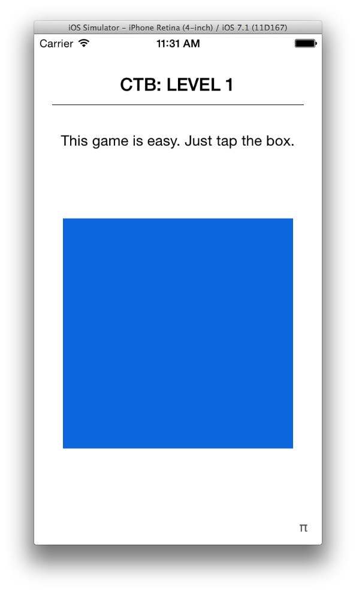

**Update: The Datastore API has been deprecated. [Learn more.](https://blogs.dropbox.com/developers/2015/04/deprecating-the-sync-and-datastore-apis/)**

# Click The Box

Simple app for the Dropbox Datastore API that demos game state.

Read more about it on [the Dropbox Developers Blog](https://www.dropbox.com/developers/blog/83/click-the-box-a-cross-platform-open-source-game-using-the-datastore-api).

### All versions

* [JavaScript](https://github.com/dropbox/ClickTheBox-js)
* [iOS](https://github.com/dropbox/ClickTheBox-ios)
* [Android](https://github.com/dropbox/ClickTheBox-android)
